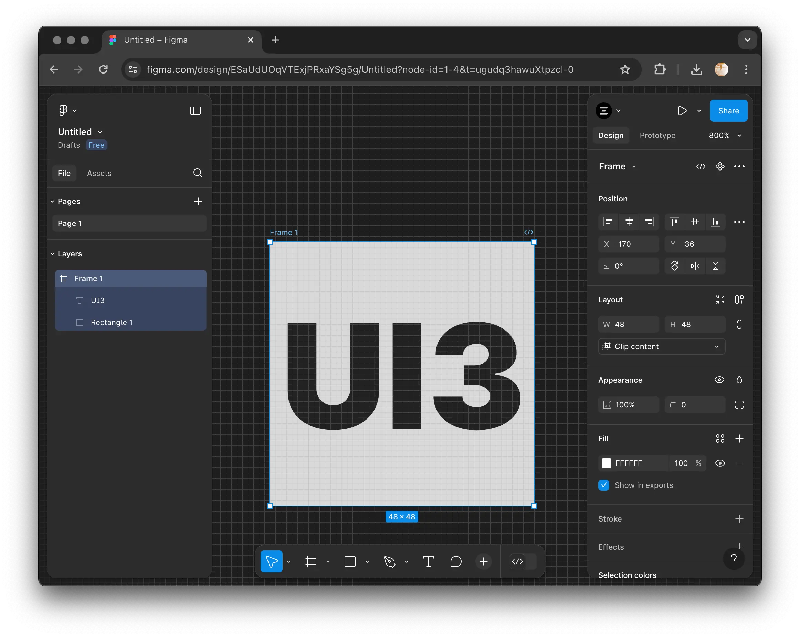

# Enable UI3 Beta for Figma

**Install: [Chrome](https://chrome.google.com/webstore/detail/enable-ui3-beta-for-figma/gdjldebhilhckhblmhklofdebemiahhi) | [Firefox](https://addons.mozilla.org/en-US/firefox/addon/enable-ui3-beta-for-figma/) | [Manually](#manual-installation)**

This extension enables UI3 Beta for Figma for all users.

> [!NOTE]
> This extension only works in web browsers and does not enable AI features.

## Manual Installation

### Chromium (Chrome, Edge, Opera, Brave, Etc.)

1. At the top of this page, click **Code** and select **Download ZIP**
2. Unzip the archive
3. Go to the extensions page (`chrome://extensions`)
4. Enable developer mode
5. Press "Load unpacked" button
6. Select folder with unzipped archive
7. Refresh any open Figma tabs

### Firefox

1. At the top of this page, click **Code** and select **Download ZIP**
2. Unzip the archive
3. Go to `about:debugging#/runtime/this-firefox`
4. Press "Load Temporary Add-on" and select zip file you downloaded
5. Installing this way on Firefox will remove it after closing browser